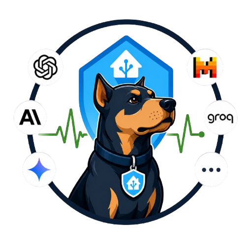

<div align="center">
  
  <br>
  <h1>🤖 LLM Watchdog</h1>
  <p><em>Monitor the health of major AI/LLM providers directly from Home Assistant.</em></p>
  <br>
  <a href="https://github.com/VoidElle/hass-llm-watchdog/releases"></a>
  <a href="https://github.com/VoidElle/hass-llm-watchdog/blob/main/LICENSE"></a>
  <br>
  <a href="https://hacs.xyz"></a>
  <a href="https://www.home-assistant.io/"></a>
  <a href="https://github.com/VoidElle/hass-llm-watchdog/stargazers"></a>
  <a href="https://github.com/VoidElle/hass-llm-watchdog/commits"></a>
  <a href="https://github.com/VoidElle/hass-llm-watchdog/actions/workflows/tests.yml"></a>
</div>

> Monitor the health of major AI/LLM providers directly from Home Assistant.

LLM Watchdog combines **passive status-page polling** (no API key required) with **optional active API probes** to give you a real-time picture of every AI provider you depend on - all as standard Home Assistant sensor entities.

## Documentation 📚

Full documentation is available in the [`docs/`](docs/) directory:

| Page | Description |
|---|---|
| [Installation](docs/installation.md) | HACS and manual install |
| [Configuration](docs/configuration.md) | Provider selection, API keys, polling interval |
| [Sensors](docs/sensors.md) | Sensor reference, states, attributes |
| [Automations](docs/automations.md) | Ready-to-use automation examples |
| [Troubleshooting](docs/troubleshooting.md) | Common issues and debug logging |

---

## Supported providers

| Provider | Status page | Active probe endpoint |
|---|---|---|
| OpenAI | ✅ | `GET /v1/models` |
| Anthropic | ✅ | `GET /v1/models` |
| Google Gemini | - | `GET /v1/models?key=…` |
| Mistral | ✅ | `GET /v1/models` |
| Cohere | ✅ | `GET /v1/models` |
| Groq | ✅ | `GET /openai/v1/models` |
| Perplexity | ✅ | `GET /models` |
| Stability AI | ✅ | `GET /v1/user/account` |
| xAI (Grok) | - | `GET /v1/models` |
| Meta/Llama (Together AI) | - | `GET /v1/models` |

Active probes only call free metadata endpoints - **never** completion or generation endpoints, so there are no token costs.

---

## Installation 📦

### Via HACS (Recommended) ⭐

[](https://my.home-assistant.io/redirect/hacs_repository/?owner=VoidElle&repository=hass-llm-watchdog&category=integration)

### Via HACS (Manual)

1. Add custom repository:
   - Open HACS in your Home Assistant interface
   - Go to the **Integrations** tab
   - Click on the three dots in the top right corner and select **Custom repositories**
   - Enter the repository URL: `https://github.com/VoidElle/hass-llm-watchdog`
   - Select **Integration** as the category
   - Click **Add**

2. Install the integration:
   - In HACS Integrations, click **+ Explore & Download Repositories**
   - Search for **LLM Watchdog**
   - Click on the integration and then **Download**
   - Select the latest version and click **Download**

3. Restart Home Assistant 🔄

### Manual Installation 🔧

1. Copy the `custom_components/llm_watchdog/` folder into your HA `config/custom_components/` directory
2. Restart Home Assistant 🔄

---

## Add the Integration to Home Assistant 🧩

After installing (via HACS or manually) and restarting Home Assistant:

1. Go to **Settings → Devices & Services**
2. Click **+ Add Integration**
3. Search for **LLM Watchdog**
4. Select providers to monitor
5. Optionally enter API keys for active probing
6. Set the polling interval in minutes (default: 5, min: 1)

To change settings later, go to the integration entry and click **Configure**.

---

## Sensors

The integration creates one sensor per enabled provider plus a summary sensor.

### Sensor states

| State | Meaning |
|---|---|
| `healthy` | Status page is green **and** active probe succeeded (or not configured) |
| `degraded` | Status page reports a minor incident, or probe was slow / partial error |
| `down` | Status page reports a major/critical outage, or probe failed / timed out |
| `unknown` | No reliable data available yet |

### Provider sensor attributes

| Attribute | Description |
|---|---|
| `provider_id` | Internal key (e.g. `openai`) |
| `provider_name` | Display name (e.g. `OpenAI`) |
| `passive_status` | Status derived from the public status page |
| `active_status` | Status from the API probe, or `not_configured` if no key is set |
| `latency_ms` | Round-trip time of the active probe in milliseconds |
| `last_checked` | ISO 8601 timestamp of the last update |
| `message` | Human-readable description from the status page or probe |

### Summary sensor (`sensor.summary`)

A single sensor that aggregates all monitored providers into one state. Useful for dashboards, automations, and notifications — e.g. trigger an alert when any provider goes down.

Its state is the **worst** status across all monitored providers:
- If even one provider is `down`, the summary is `down`
- If no provider is `down` but one is `degraded`, the summary is `degraded`
- If all providers are `healthy`, the summary is `healthy`
- If no data is available yet, the summary is `unknown`

Extra attributes:

| Attribute | Description |
|---|---|
| `providers` | Full result dict keyed by provider ID |
| `counts` | `{healthy: N, degraded: N, down: N, unknown: N}` |

---

## Example Lovelace card

```yaml
type: entities
title: LLM Watchdog
entities:
  - entity: sensor.summary
    name: Overall
  - sensor.openai
  - sensor.anthropic
  - sensor.google_gemini
  - sensor.mistral
  - sensor.groq
```

For a grid layout with status badges, use the [custom button-card](https://github.com/custom-cards/button-card):

```yaml
type: grid
columns: 3
cards:
  - type: custom:button-card
    entity: sensor.openai
    name: OpenAI
    show_state: true
  - type: custom:button-card
    entity: sensor.anthropic
    name: Anthropic
    show_state: true
```

---

## Tests 🧪

The test suite lives in `tests/` and uses [`pytest-homeassistant-custom-component`](https://github.com/MatthewFlamm/pytest-homeassistant-custom-component).

### Run tests

```bash
pip install pytest-homeassistant-custom-component
pytest tests/ -v
```

### What is tested

- Sensor creation for each configured provider
- Combined status logic for all combinations (healthy / degraded / down / unknown)
- Active probe HTTP status codes (200 / 429 / 500 / timeout)
- Summary sensor worst-status aggregation
- Unavailability for API-key-only providers with no key configured
- Coordinator respects configured scan interval

## Adding a new provider

Open a pull request using the [**Add provider** template](https://github.com/VoidElle/hass-llm-watchdog/compare?template=add_provider.md). The template covers:

1. Adding the entry to `providers.json`
2. Updating `translations/en.json` and `translations/it.json` with the new API key label
3. Verifying the status page URL and active probe endpoint

The new provider will appear in the configuration flow automatically after the next restart.

---

## API cost & rate-limit note

Active probes use lightweight metadata endpoints and carry no generation cost. However, they do count as API requests and may be subject to your plan's rate limits. If you're on a strict free tier, consider leaving the API key blank and relying on passive monitoring alone.
